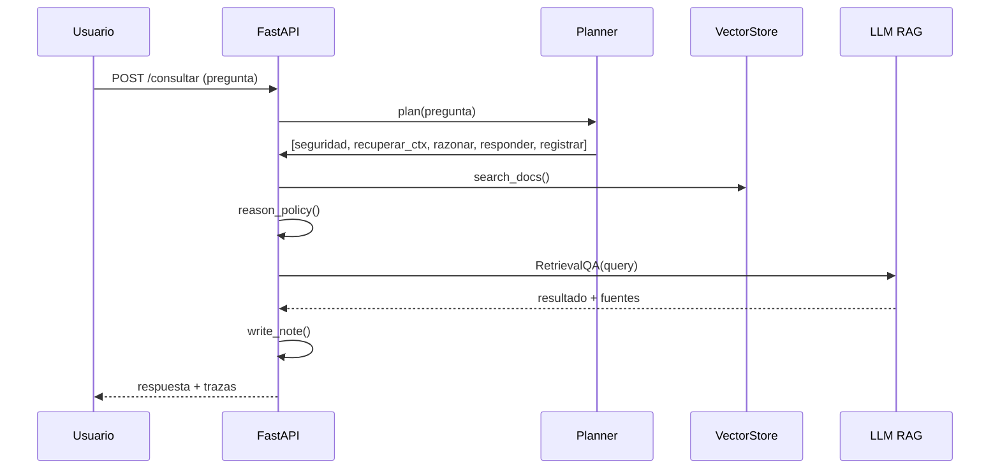

#  Ingeniería de IA – Agente RAG EP2 
Este repositorio contiene el **agente funcional** para la Evaluación Parcial N°2. Integra **herramientas** (consulta, escritura y razonamiento), **memoria** (corto y largo plazo), **planificación** y **toma de decisiones adaptativa**.

## Stack
- FastAPI + Uvicorn
- LangChain (RAG con FAISS + HuggingFace Embeddings)
- OpenAI Chat API (ChatOpenAI)
- Python 3.10+

## Instalación
```bash
pip install -r requirements.txt
```
> Copia `.env.example` a `.env` y define `OPENAI_API_KEY` (u otras credenciales según tu proveedor).

## ▶️ Ejecución
```bash
uvicorn app_ep2:app --host 0.0.0.0 --port 8000 --reload
```

- `GET /salud` → estado del servicio  
- `POST /consultar` → cuerpo: `{"pregunta":"..."}`  
- `GET /memoria/corto` → muestra buffer de conversación  
- `POST /nota` → registra notas operacionales

## 🧱 Estructura
```
.
├── app_ep2.py
├── requirements.txt
├── .env.example
├── docs/
│   ├── diagrama_orquestacion.mmd
│   └── flujo_tareas.mmd
├── data/
│   └── (se generan notas JSONL)
└── tests/
    └── smoke.http
```

## 🧠 Cómo cumple IE1–IE10
- **IE1** Herramientas: `search_docs`, `write_note`, `reason_policy`.
- **IE2** Frameworks escalables/compatibles: LangChain, FAISS, HuggingFace, ChatOpenAI.
- **IE3** Memoria corto plazo: `ShortMemory` (buffer).
- **IE4** Memoria largo plazo / recuperación: FAISS + embeddings + `RetrievalQA`.
- **IE5** Planificación: `TaskPlanner` (prioriza seguridad → contexto → razonar → responder → registrar).
- **IE6** Decisiones adaptativas: `reason_policy` + traza `planner/tooltrace`.
- **IE7** README + diagramas Mermaid en `/docs`.
- **IE8** Justificación de componentes: ver este README y comentarios en código.
- **IE9** Informe técnico (puedes extraer evidencias de `/memoria/corto`, `traces_ep2.log`, respuestas del endpoint).
- **IE10** Lenguaje técnico y ejemplos reproducibles.

## 🧩 Diagramas (Mermaid)
### Orquestación
```mermaid
graph TD
    U[Usuario] --> A[FastAPI /consultar]
    A --> P[TaskPlanner]
    P --> S[Seguridad]
    S --> C{Sensibles?}
    C -- Sí --> D[Derivar]
    C -- No --> R[Retriever FAISS]
    R --> L[LLM (ChatOpenAI) + RetrievalQA]
    L --> W[write_note JSONL]
    L --> O[Respuesta]
```

### Flujo de tareas


##  Seguridad
- Sin tokens hardcodeados.
- Sanitización de respuestas ante posibles datos sensibles.
- Derivación cuando no hay contexto suficiente o hay riesgo.

## Prueba rápida
Usa `tests/smoke.http` con una extensión REST Client o copia los curl del README.


## Autoría

Bryan  Saavedra 
Estudiante de Ingeniería en Informática – Duoc UC
Asignatura: ISY0101 – Ingeniería de Inteligencia Artificial
Sección: 002D

